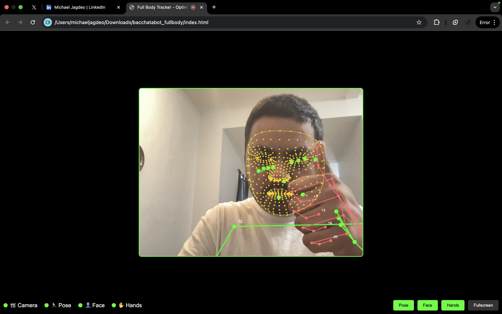

# 🎯 Full Body Tracker - Optimized Performance

A high-performance, real-time full body tracking application using MediaPipe that tracks pose, face, and hands simultaneously with optimized performance and smooth user experience.



## ✨ Features

- **🎯 Real-time Full Body Tracking**: Simultaneous tracking of pose, face, and hands
- **⚡ Optimized Performance**: Frame rate limiting and efficient rendering for smooth operation
- **🎮 Interactive Controls**: Toggle individual tracking modules on/off
- **📊 Live Status Indicators**: Real-time status monitoring for camera and tracking modules
- **🖥️ Fullscreen Support**: Immersive fullscreen mode for better tracking experience
- **🔧 Error Handling**: Robust error handling with user-friendly error messages
- **📱 Responsive Design**: Works across different screen sizes and devices

## 🚀 Quick Start

### Prerequisites

- Modern web browser with WebRTC support (Chrome, Firefox, Safari, Edge)
- Webcam access permissions
- Stable internet connection (for MediaPipe CDN libraries)

### Installation

1. **Clone or download** this repository
2. **Open** `index.html` in your web browser
3. **Allow camera access** when prompted
4. **Start tracking** - the application will automatically initialize all modules

```bash
# If using git
git clone <repository-url>
cd bacchatabot_fullbody
open index.html
```

## 🎮 Usage

### Controls

- **Pose Button**: Toggle full body pose tracking (green skeleton overlay)
- **Face Button**: Toggle facial landmark tracking (golden face mesh)
- **Hands Button**: Toggle hand tracking (colored hand landmarks)
- **Fullscreen Button**: Enter/exit fullscreen mode for immersive tracking

### Status Indicators

The bottom status bar shows real-time status of each tracking module:

- 🟢 **Green**: Active and detecting
- 🟡 **Yellow**: Searching for features
- 🔴 **Red**: Error or disabled

### Performance Tips

- **Good Lighting**: Ensure adequate lighting for better tracking accuracy
- **Clear Background**: Use a plain background for optimal performance
- **Stable Position**: Stay within camera view for consistent tracking
- **Module Toggle**: Disable unused modules to improve performance

## 🏗️ Architecture

### Core Components

- **FullBodyTracker Class**: Main tracking orchestrator
- **MediaPipe Integration**: Pose, FaceMesh, and Hands modules
- **Canvas Rendering**: Real-time video overlay with tracking visualizations
- **Performance Optimization**: Frame rate limiting and efficient rendering

### Technical Stack

- **Frontend**: Vanilla JavaScript, HTML5, CSS3
- **Computer Vision**: MediaPipe (Google's ML framework)
- **Video Processing**: WebRTC getUserMedia API
- **Rendering**: HTML5 Canvas for real-time overlays

### Performance Optimizations

- **Frame Rate Limiting**: Capped at 30 FPS for consistent performance
- **Sequential Module Loading**: Prevents WASM conflicts
- **Throttled Logging**: Reduces console output overhead
- **Efficient Rendering**: Optimized canvas operations
- **Error Recovery**: Graceful fallbacks for failed modules

## 📁 Project Structure

```
bacchatabot_fullbody/
├── index.html              # Main application entry point
├── js/
│   └── fullbody_working.js # Core tracking logic and MediaPipe integration
├── png/
│   └── bacchatabot_fullbody_screenshot.png  # Application screenshot
└── README.md               # This file
```

## 🔧 Configuration

### MediaPipe Settings

The application uses optimized settings for performance:

```javascript
// Pose tracking
modelComplexity: 0,           // Lightest model
smoothLandmarks: false,       // Disabled for speed
minDetectionConfidence: 0.3,  // Balanced accuracy/performance

// Face tracking
maxNumFaces: 1,              // Single face tracking
refineLandmarks: false,       // Disabled for performance

// Hand tracking
maxNumHands: 2,              // Both hands
modelComplexity: 0,          // Lightest model
```

### Customization

You can modify tracking parameters in `js/fullbody_working.js`:

- **Detection Confidence**: Adjust `minDetectionConfidence` values
- **Model Complexity**: Change `modelComplexity` for accuracy vs. performance
- **Frame Rate**: Modify `targetFps` in the constructor
- **Visual Styles**: Customize colors and line widths in drawing functions

## 🐛 Troubleshooting

### Common Issues

**Camera Not Working**
- Ensure camera permissions are granted
- Check if camera is being used by another application
- Try refreshing the page

**Poor Tracking Performance**
- Improve lighting conditions
- Clear background clutter
- Disable unused tracking modules
- Check browser performance

**Module Initialization Errors**
- Ensure stable internet connection
- Try refreshing the page
- Check browser console for specific errors

### Browser Compatibility

- ✅ **Chrome**: Full support
- ✅ **Firefox**: Full support
- ✅ **Safari**: Full support (macOS 11+)
- ✅ **Edge**: Full support

## 🤝 Contributing

Contributions are welcome! Please feel free to submit issues and enhancement requests.

### Development Setup

1. Fork the repository
2. Create a feature branch
3. Make your changes
4. Test thoroughly
5. Submit a pull request

## 📄 License

This project is open source and available under the [MIT License](LICENSE).

## 🙏 Acknowledgments

- **MediaPipe**: Google's ML framework for computer vision
- **WebRTC**: Real-time communication APIs
- **HTML5 Canvas**: Graphics rendering capabilities

---

**Made with ❤️ for real-time computer vision enthusiasts**

*For questions, issues, or contributions, please open an issue on GitHub.* 